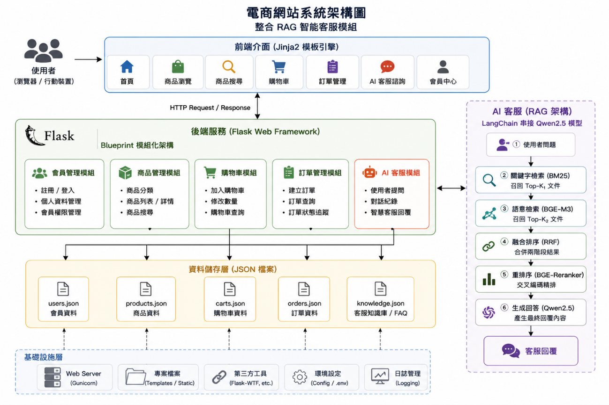
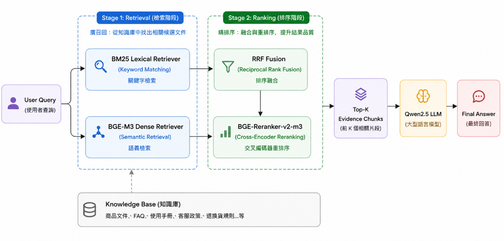
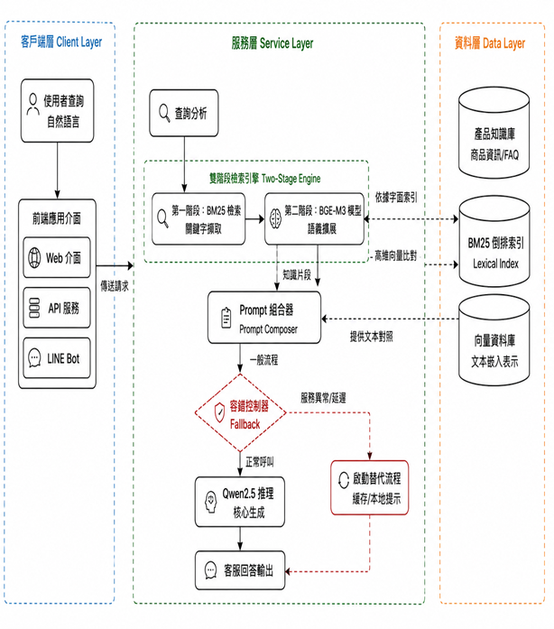

# 🚀 Dual-Stage RAG for E-Commerce Customer Service

> A Dual-Stage Retrieval-Augmented Generation Framework for Chinese E-Commerce Customer Service

**Master Thesis Project**  
Graduate Institute of Artificial Intelligence  
Kun Shan University

Author: Quan-Fu Chen


---

# 📖 Project Overview

This project proposes a Dual-Stage Retrieval-Augmented Generation (RAG) framework designed for Chinese E-Commerce Customer Service scenarios.

The system combines:

- BM25 Lexical Retrieval
- BGE-M3 Dense Retrieval
- Reciprocal Rank Fusion (RRF)
- BGE-Reranker-v2-m3
- Qwen2.5 Large Language Model
- Flask E-Commerce Website
- Streamlit Evaluation Dashboard

The objective is to improve retrieval accuracy, answer reliability, and reduce hallucinations in customer service environments.

---

# 🏪 E-Commerce System Architecture

<p align="center">
  
</p>

The platform integrates product management, shopping cart, order management and AI customer service modules into a unified e-commerce environment.

---

# 🔍 Dual-Stage RAG Architecture

<p align="center">
  
</p>

## Stage 1 — Retrieval

- BM25 Lexical Retriever
- BGE-M3 Dense Retriever

## Stage 2 — Ranking

- RRF Fusion
- BGE-Reranker-v2-m3

## Generation

- Top-K Context Construction
- Qwen2.5 LLM
- Final Answer Generation

---

# 🏗️ Three-Layer System Architecture

<p align="center">
  
</p>

The system adopts a three-layer architecture:

- Client Layer
- Service Layer
- Data Layer

This design improves scalability, maintainability and deployment flexibility.

---

# 📊 Benchmark Results

| Metric | Result |
|----------|----------|
| Hit@5 | 1.0000 |
| MRR | 0.9401 |
| NDCG@5 | 0.9125 |
| Coverage Proxy | 1.0000 |
| Average Latency | 188.66 ms |
| P95 Latency | 217.64 ms |

---

# ⚙️ Technology Stack

### Retrieval

- BM25
- BGE-M3
- FAISS

### Ranking

- RRF
- BGE-Reranker-v2-m3

### Generation

- Qwen2.5
- Ollama

### Web Framework

- Flask
- Jinja2

### Dashboard

- Streamlit
- Plotly

---

# 📂 Project Structure

```text
3fm
├── app.py
├── run_web.py
├── app_streamlit.py
├── knowledge_base
├── rag
│   ├── retrieval
│   ├── reranker
│   ├── generator
│   └── pipeline.py
├── routes
├── templates
├── static
├── docs
│   └── images
└── evaluation_results
