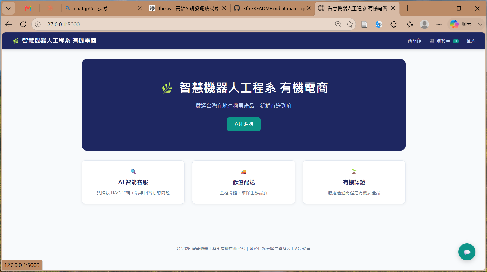
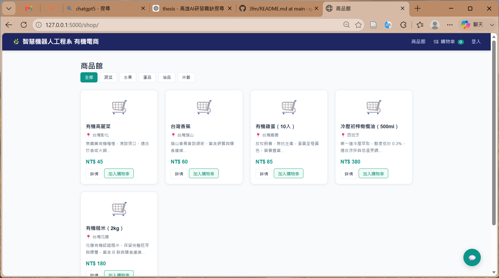
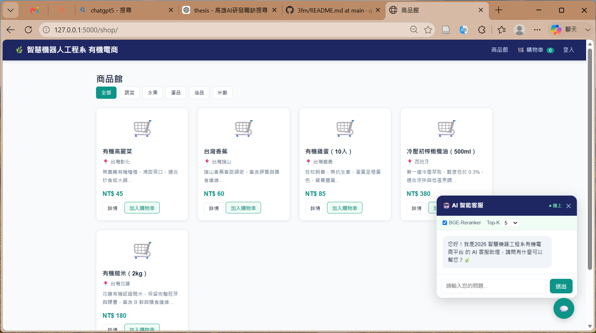
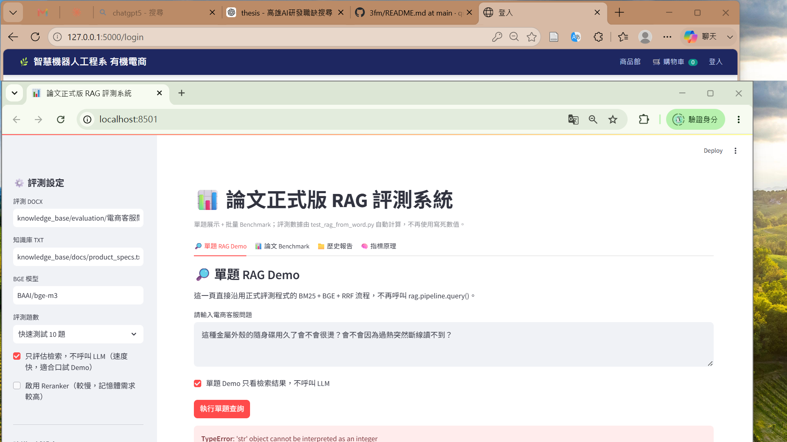
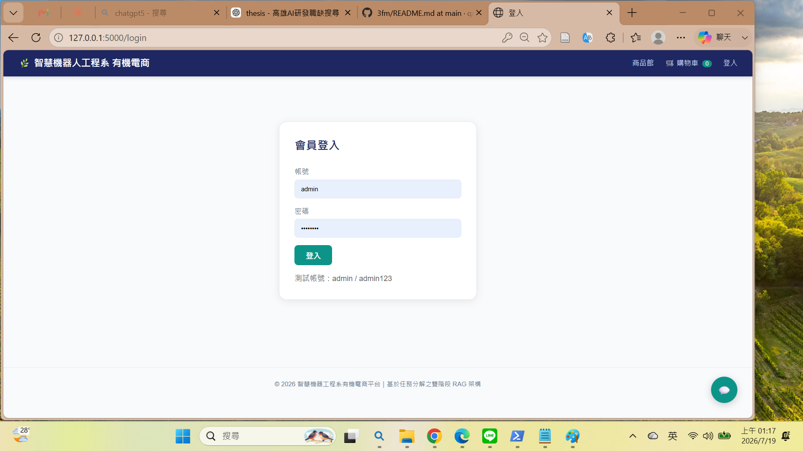

# 🚀 3fm Dual-Stage RAG E-Commerce Customer Service System

> A Dual-Stage Retrieval-Augmented Generation Framework for Chinese E-Commerce Customer Service

**Master Thesis Project**
Kun Shan University
Department of Intelligent Robotics Engineering

Author: **Quan-Fu Chen**

---


---

# 📖 Project Overview

This project implements a complete E-Commerce Customer Service Platform integrated with a Dual-Stage Retrieval-Augmented Generation (RAG) architecture.

The system combines:

- BM25 Lexical Retrieval
- BGE-M3 Dense Retrieval
- Reciprocal Rank Fusion (RRF)
- BGE-Reranker-v2-m3
- Qwen2.5 Local LLM
- Flask E-Commerce Platform
- Streamlit Benchmark Dashboard

---

# 🏗 System Architecture

Three-layer architecture integrating Web System and AI Customer Service.


---

# 🔄 Dual-Stage RAG Pipeline

The core contribution of this research.

### Stage 1 Retrieval

- BM25 Lexical Retrieval
- BGE-M3 Dense Retrieval

### Stage 2 Ranking

- RRF Fusion
- BGE-Reranker-v2-m3

### Generation

- Qwen2.5 LLM


---

# 🛒 E-Commerce Architecture

Complete E-Commerce Platform Architecture.


---

# 📸 Demo Screenshots

## Home Page



---

## Product Catalog



---

## AI Customer Service



---

## Benchmark Dashboard



---

## System Demonstration



---

# 📊 Benchmark Results

| Metric | Result |
|----------|----------|
| Hit@5 | 1.0000 |
| MRR | 0.9401 |
| NDCG@5 | 0.9125 |
| Coverage Proxy | 1.0000 |
| Average Latency | 188.66 ms |
| P95 Latency | 217.64 ms |

---

# ✨ Features

## AI Customer Service

- Chinese Q&A
- Local LLM
- Multi-document Retrieval
- Source Citation
- RAG Pipeline

## E-Commerce Functions

- User Login
- Product Search
- Product Detail
- Shopping Cart
- Order Management
- Knowledge Base Management

---

# 💻 Technology Stack

### Backend

- Python
- Flask
- Jinja2

### Retrieval

- BM25
- BGE-M3
- FAISS

### Ranking

- RRF
- BGE-Reranker-v2-m3

### LLM

- Ollama
- Qwen2.5

### Dashboard

- Streamlit

---

# 🚀 Quick Start

## Clone Repository

```bash
git clone https://github.com/quanfu2026/3fm.git

cd 3fm
```

## Create Virtual Environment

```bash
python -m venv .venv
```

Windows

```bash
.venv\Scripts\activate
```

Install Packages

```bash
pip install -r requirements.txt
```

## Run Flask Web

```bash
python run_web.py
```

Open:

```text
http://127.0.0.1:5000
```

## Run Dashboard

```bash
streamlit run app_streamlit_thesis_v3.py
```

Open:

```text
http://localhost:8501
```

---

# 🎓 Research Contributions

- Dual-Stage Retrieval Architecture
- BM25 Sparse Retrieval
- BGE-M3 Dense Retrieval
- Reciprocal Rank Fusion
- BGE-Reranker-v2-m3
- Qwen2.5 Local LLM
- Flask E-Commerce Integration
- Streamlit Benchmark Dashboard
- Chinese E-Commerce Customer Service Dataset
- Reproducible Evaluation Framework

---

# 📜 License

MIT License

---

# 👨‍💻 Author

Quan-Fu Chen

GitHub:

https://github.com/quanfu2026

---

⭐ If this project helps you, please consider giving it a Star.
